# mdview

> A lightweight, modern markdown renderer for your terminal, your desktop, and your Neovim buffer.

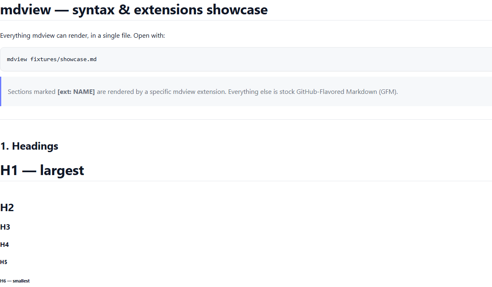

`mdview` renders GitHub-flavored markdown with built-in support for syntax
highlighting, math, mermaid, draw.io, and plotly — all bundled into a single
Rust binary. Three surfaces share the same core:

- **Desktop** (default): a Tauri window with a curvy, modern look and WS
  live-reload.
- **Terminal**: a `ratatui` + `crossterm` pager with rounded box-drawing,
  truecolor ANSI, and sixel-rendered diagrams.
- **Neovim**: a Lua plugin streams your buffer over a pipe, debounced on
  `TextChanged` / `TextChangedI`, with theme sync from your current
  colorscheme.

## Install

### With cargo

```sh
cargo install --locked --path apps/mdview
```

### With winget on Windows

```pwsh
winget install mdview.mdview
```

Release publishing builds the Windows portable package and submits winget updates after the initial
`mdview.mdview` manifest has been bootstrapped in `microsoft/winget-pkgs`.

### From source

```sh
git clone https://github.com/aloknigam247/mdview
cd mdview
cargo build --workspace --release
# Optional: terminal sidecar for mermaid / drawio / plotly in the terminal surface
cd sidecar && bun build --compile ./src/index.ts --outfile ../target/release/mdview-sidecar
```

The resulting binary is `target/release/mdview` (`.exe` on Windows).

## Quick start

```sh
# Desktop (default): opens a Tauri window and detaches
mdview README.md

# Terminal pager with sixel diagrams
mdview --terminal README.md

# Pipe-friendly (no pager)
mdview --terminal --no-pager README.md | less -R

# Watch a file for changes in either mode
mdview --watch README.md
mdview --terminal --watch README.md
```

### Neovim plugin

This repository is itself a Neovim plugin: `lua/mdview/` ships alongside the
Rust crates and the binary. The plugin spawns `mdview --nvim-socket <path>` and
streams the current buffer over a Unix socket (Windows named pipe) using
length-prefixed msgpack frames, debounced ~100 ms on `TextChanged` /
`TextChangedI`. Colorscheme changes resync the theme.

Requirements: Neovim >= 0.10 and the `mdview` binary on `PATH`.

Commands are registered when you call `require("mdview").setup({})`. With
[lazy.nvim](https://github.com/folke/lazy.nvim), `opts` does that for you:

```lua
{
  "aloknigam247/mdview",
  build = "cargo install --locked --path apps/mdview",
  ft = { "markdown" },
  opts = {
    debounce_ms = 100,
    cmd = "mdview",
    theme_from_colorscheme = true,
  },
}
```

For local development, point `dir` at your checkout:

```lua
{
  dir = "~/code/mdview",
  ft = "markdown",
  opts = {},
}
```

Without a plugin manager, call `setup` yourself (e.g. in `init.lua`):

```lua
require("mdview").setup({})
```

Commands:

```vim
:MdView [file]         " toggle the live preview for the current (or given) buffer
:MdViewStop            " close the preview window
:Mdview refresh_cache  " rebuild cached theme after colorscheme changes
```

Options:

| key | default | description |
|---|---|---|
| `debounce_ms` | `100` | Delay between buffer edits and the next render. |
| `cmd` | `"mdview"` | Path or name of the mdview binary. |
| `socket_path` | `nil` | Custom socket/pipe path. Auto-generated if unset. |
| `theme_from_colorscheme` | `true` | Sync the mdview theme from your nvim colorscheme. |

## Gallery

All of the following are rendered from a single file —
[`fixtures/showcase.md`](./fixtures/showcase.md) — which you can open with
`mdview fixtures/showcase.md` to see them live.

### GFM core

| | |
|---|---|
| **Inline styles** — bold, italic, strikethrough, inline code, links, autolinks, `<sub>` / `<sup>` | 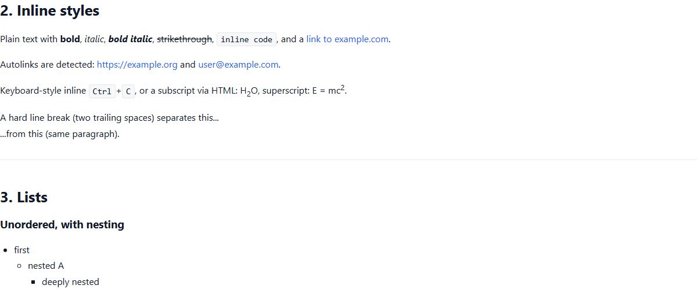 |
| **Lists** — bullet, ordered, deeply nested, task-list checkboxes | 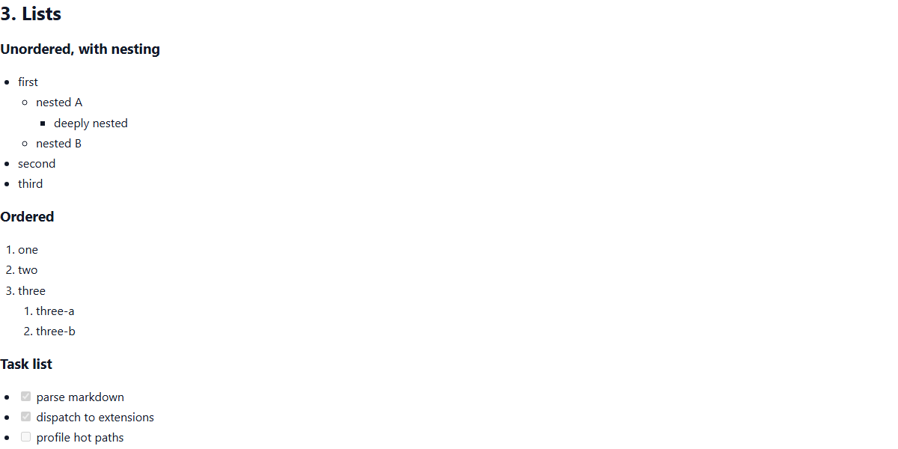 |
| **Tables** — GFM with left / center / right alignment and rounded corners | 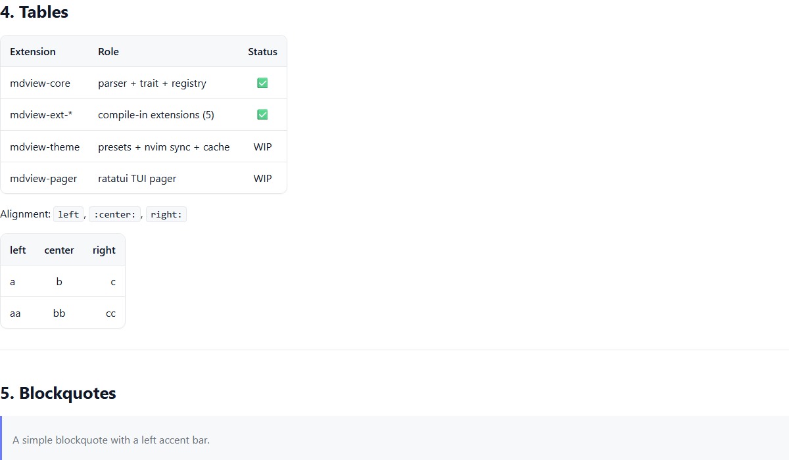 |
| **Blockquote** — accent bar + rounded container | 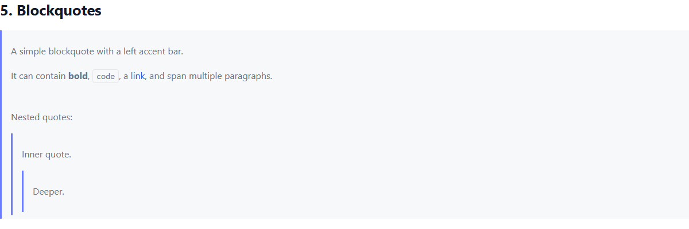 |

### Extensions

| | |
|---|---|
| **Syntax highlight** — via `syntect`, server-rendered into inline-styled spans | 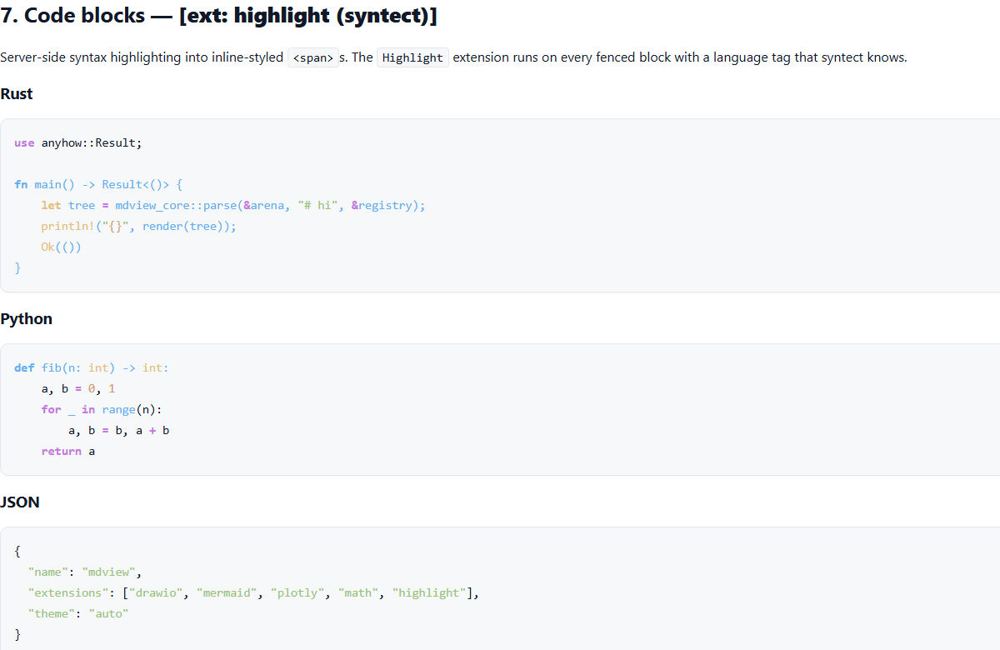 |
| **Math** — `$…$` inline, `$$…$$` display, ` ```math ` fenced blocks — rendered by KaTeX | 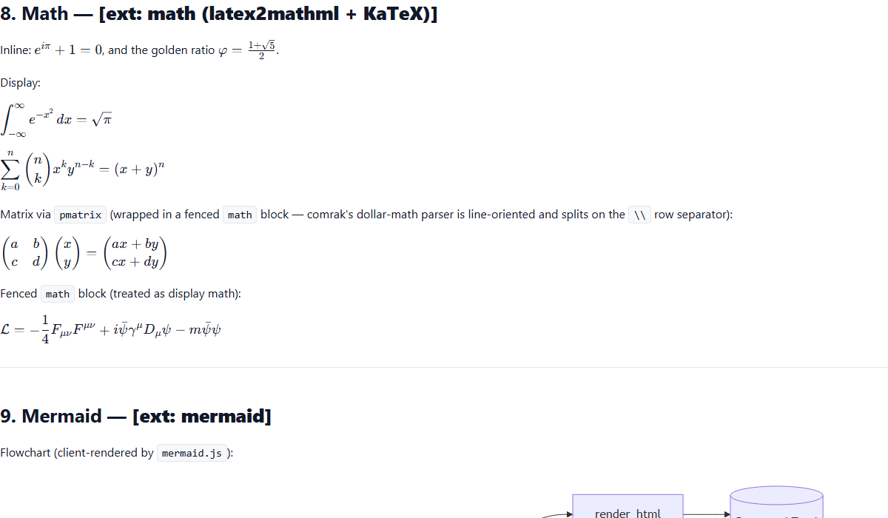 |
| **Mermaid** — flowcharts, sequence, class, state diagrams | 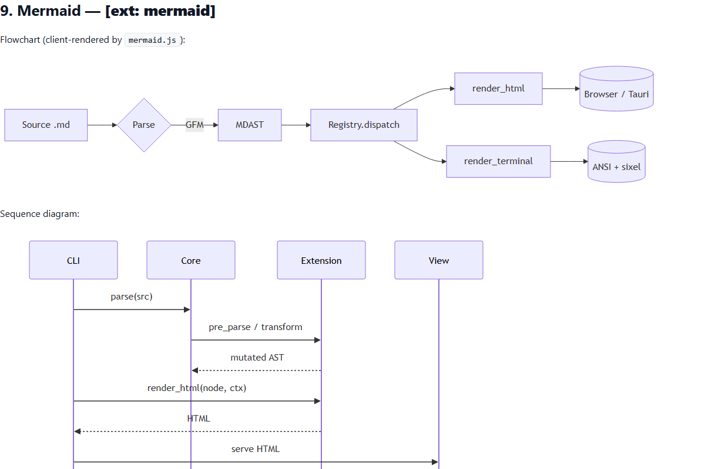 |
| **Draw.io** — embedded `<mxfile>` XML in a fenced block | 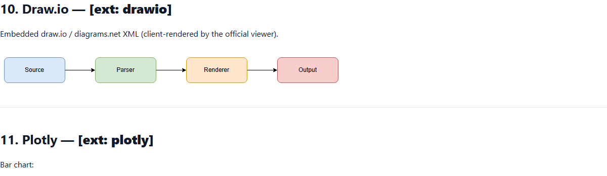 |
| **Plotly** — JSON chart specs in a fenced block, interactive | 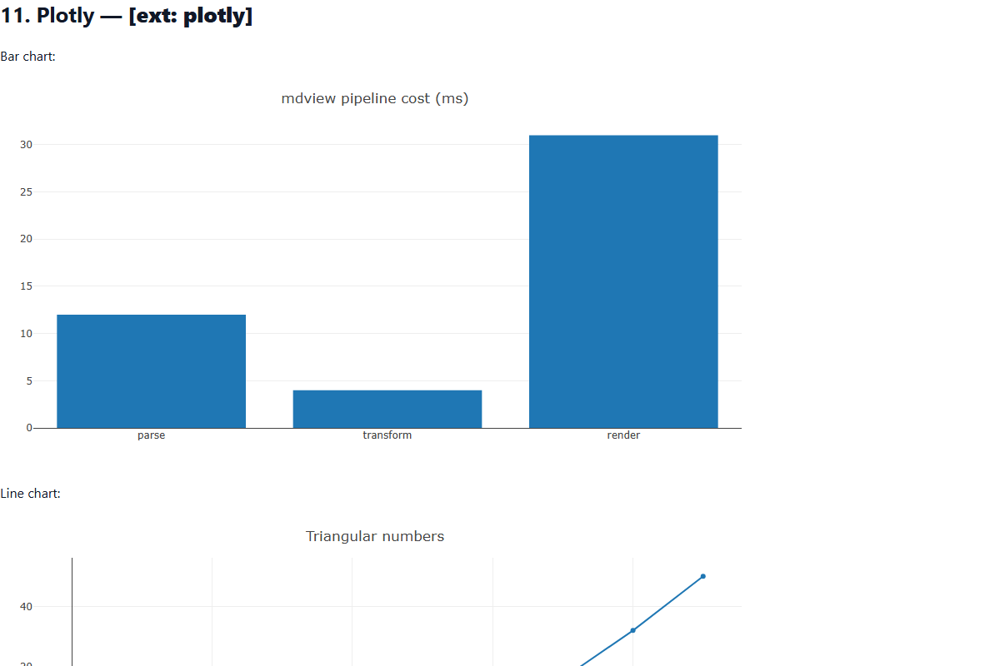 |

### Layout

No fixed page width — mdview grows horizontally for long lines / wide content:

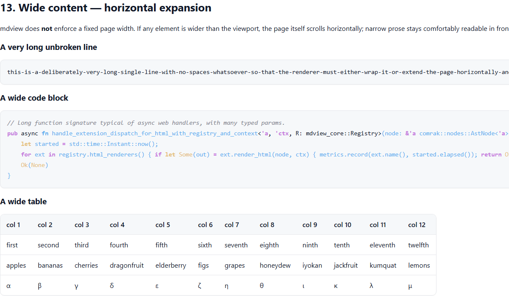

## Theme customisation

### Built-in presets

`mdview` ships built-in Catppuccin presets. Theme selection is driven by the
`[theme]` section of `config.toml` — set `mode` (`auto` | `light` | `dark`) and
the `light` / `dark` preset names:

```toml
[theme]
mode = "auto"
light = "catppuccin-latte"
dark = "catppuccin-mocha"
```

Inside Tauri, use the theme picker in the bottom-right corner of the window to
cycle presets at runtime — the choice is persisted per-user.

### Neovim colorscheme sync

When invoked from Neovim the bridge synthesises a theme from your current
highlight groups (`Normal`, `Function`, `Comment`, `String`,
`@markup.heading.*`, …) and caches the result at:

```
<data-dir>/mdview/theme-cache/<colorscheme>-<nvim-version>.json
```

On subsequent launches mdview reads the cache entry instead of re-querying
Neovim. If your colorscheme changes or you tweak highlight groups, force a
rebuild with `:MdViewRebuildThemeCache`.

### Adding a new preset

Built-in themes only — no JSON loader, no dotfile. Add a file under
`crates/mdview-theme/src/themes/<name>.rs`:

```rust
use crate::{Radii, StyleSpec, Theme, Typography};
use std::collections::BTreeMap;

pub fn mytheme() -> Theme {
    Theme {
        name: "mytheme",
        colors: BTreeMap::from([
            ("fg", "#e0def4"),
            ("bg", "#191724"),
            ("accent", "#c4a7e7"),
            ("muted", "#6e6a86"),
            ("code.bg", "#1f1d2e"),
            ("link", "#9ccfd8"),
        ]),
        styles: BTreeMap::from([
            ("heading.1", StyleSpec::bold("#eb6f92")),
            ("heading.2", StyleSpec::bold("#f6c177")),
            ("blockquote", StyleSpec::italic("#908caa")),
        ]),
        radii: Radii { sm: 6, md: 10, lg: 16 },
        typography: Typography::default_modern(),
    }
}
```

Register it alphabetically in `crates/mdview-theme/src/presets.rs`:

```rust
pub fn presets() -> Vec<Theme> {
    vec![
        themes::dark::dark(),
        themes::dracula::dracula(),
        themes::light::light(),
        themes::mytheme::mytheme(),
        themes::solarized::solarized(),
    ]
}
```

Rebuild, then select it via the `[theme]` section of `config.toml` (set `light`
or `dark` to `mytheme`).

## Extension authoring

Every markdown extension is a Rust crate that implements the
`MdViewExtension` trait and is registered in the core's `builtins.rs`. There
is exactly **one channel** — the compile-in built-in — so authoring a new
extension means adding a new crate to the workspace.

### Step 1 — scaffold a crate

```sh
cargo new --lib crates/mdview-ext-callout
```

Add it to the workspace in `Cargo.toml`:

```toml
[workspace]
members = [
  # … existing crates, alphabetical …
  "crates/mdview-ext-callout",
]
```

### Step 2 — implement the trait

```rust
// crates/mdview-ext-callout/src/lib.rs
use mdview_core::{Asset, AstNode, Html, MdViewExtension, RenderCtx, TermChunks};

pub struct Callout;

impl MdViewExtension for Callout {
    fn name(&self) -> &'static str { "callout" }

    fn register_parser(&self, opts: &mut comrak::ComrakOptions) {
        opts.extension.block_directives = true;
    }

    fn pre_parse(&self, src: &mut String) {
        // optionally rewrite a bespoke syntax into a comrak-friendly form
    }

    fn transform(&self, _node: &mut AstNode) {}

    fn render_html(&self, n: &AstNode, ctx: &RenderCtx) -> Option<Html> {
        // return Some(Html(...)) for nodes your extension owns
        None
    }

    fn render_terminal(&self, _n: &AstNode, _ctx: &RenderCtx) -> Option<TermChunks> {
        None
    }

    fn client_assets(&self) -> &'static [Asset] { &[] }
}
```

### Step 3 — register it

In `crates/mdview-core/src/builtins.rs`, alphabetical order:

```rust
pub fn builtin_extensions() -> Vec<Box<dyn MdViewExtension>> {
    vec![
        Box::new(mdview_ext_callout::Callout),
        Box::new(mdview_ext_drawio::Drawio),
        Box::new(mdview_ext_highlight::Highlight),
        Box::new(mdview_ext_math::Math),
        Box::new(mdview_ext_mermaid::Mermaid),
        Box::new(mdview_ext_plotly::Plotly),
    ]
}
```

### Step 4 — add a fixture and test

Drop a `fixtures/callout.md` file showcasing the extension and add it to
`tests/e2e/tests/fixtures.spec.ts`. `cargo test --workspace` + `npx playwright
test` will cover your new surface.

### What extensions may and may not do

- **May**: toggle comrak parser flags, walk the AST in `transform`, emit
  HTML/ANSI for nodes they own, declare static client-side JS/CSS assets
  (bundled into the webview at build time).
- **May not**: depend on other extension crates, load user-supplied code,
  register themselves from outside the workspace. Built-ins only.

## Architecture

See [AGENTS.md](./AGENTS.md) for the full architecture reference (crate
matrix, interaction sequences, trait + theme contracts, extensibility model,
and non-goals).

## License

MIT © mdview contributors. See [LICENSE](./LICENSE).
