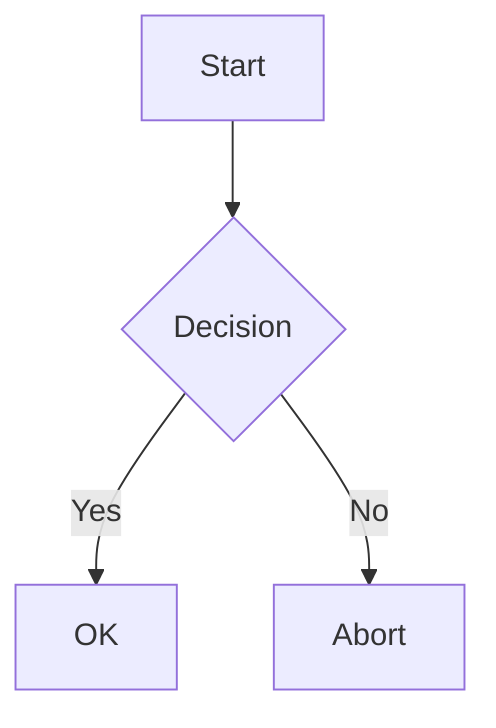
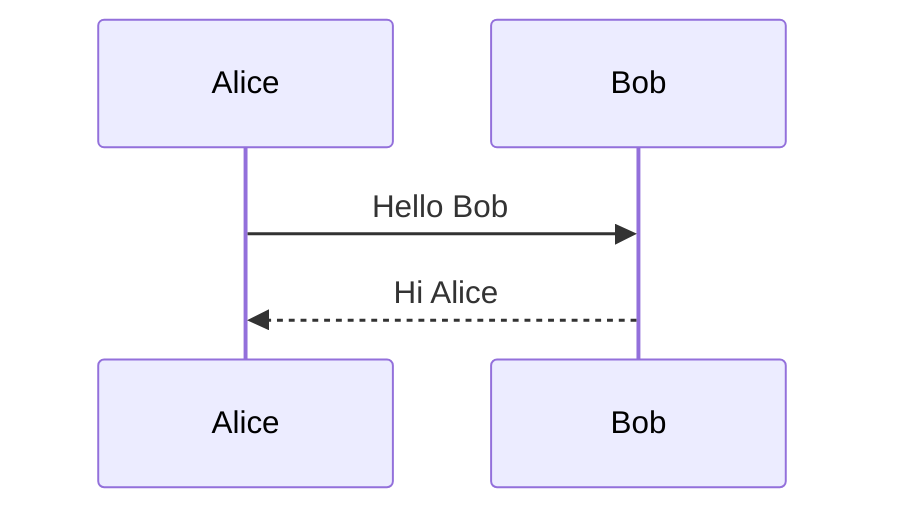

# Mermaid Fixture

A simple flowchart:

```mermaid
graph TD
    A[Start] --> B{Decision}
    B -->|Yes| C[OK]
    B -->|No| D[Abort]
```

A sequence diagram:

```mermaid
sequenceDiagram
    Alice->>Bob: Hello Bob
    Bob-->>Alice: Hi Alice
```
