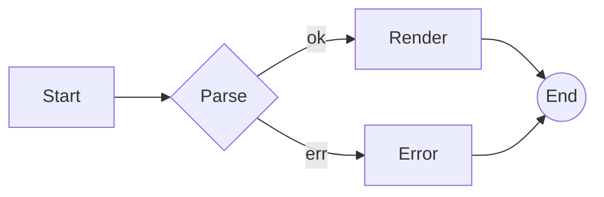
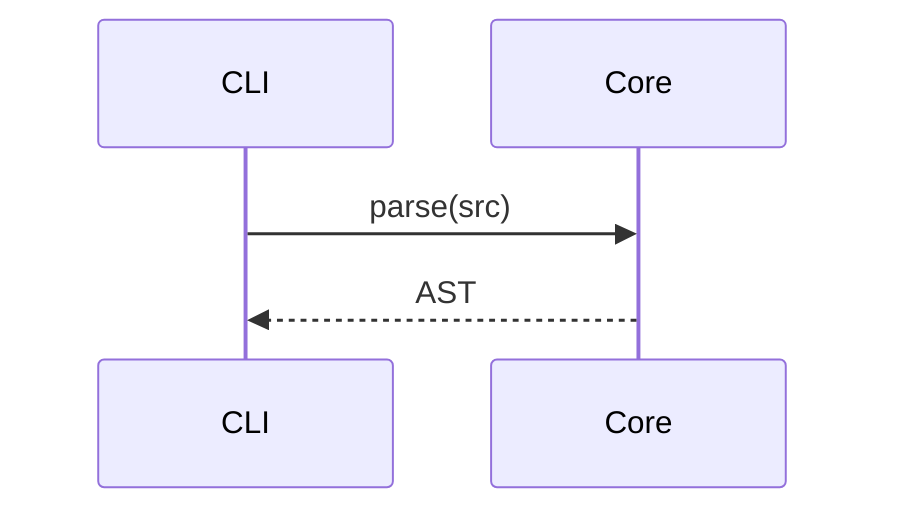

# mdview — everything

Paragraph with **bold**, *italic*, ***both***, ~~strikethrough~~,
`inline code`, a [link](https://example.com), and autolink https://example.org.

## Lists

- apples
  - gala
  - fuji
- bananas
- cherries

1. first
2. second
3. third

- [x] scaffold
- [ ] ship
- [ ] celebrate ╰(°▽°)╯

## Tables

| Crate                 | Role          | Status |
|-----------------------|---------------|:------:|
| mdview-core           | parser + trait |   OK   |
| mdview-theme          | presets        |   WIP  |
| mdview-render-html    | HTML output    |   WIP  |
| mdview-render-terminal| ANSI output    |   WIP  |

## Blockquote

> ╭ a rounded quote ╮
>
> Quotes can span multiple lines and contain **bold**,
> `code`, and a [link](https://example.com).

## Code

```rust
fn main() {
    println!("╭─ hello, mdview ─╮");
}
```

```ts
export const radii = { sm: 6, md: 10, lg: 16 };
```

```python
def square(x: int) -> int:
    return x * x
```

## Math

Inline: $e^{i\pi} + 1 = 0$.

Display:

$$
\int_{-\infty}^{\infty} e^{-x^2}\, dx = \sqrt{\pi}
$$

```math
\sum_{i=1}^{n} i = \frac{n(n+1)}{2}
```

## Mermaid





## Draw.io

```drawio
<mxfile host="app.diagrams.net">
  <diagram name="Page-1" id="p1">
    <mxGraphModel dx="800" dy="600" grid="1" gridSize="10" page="1" pageScale="1" pageWidth="850" pageHeight="1100">
      <root>
        <mxCell id="0" />
        <mxCell id="1" parent="0" />
        <mxCell id="2" value="Core" style="rounded=1;whiteSpace=wrap;html=1;" vertex="1" parent="1">
          <mxGeometry x="120" y="160" width="120" height="40" as="geometry" />
        </mxCell>
        <mxCell id="3" value="Renderer" style="rounded=1;whiteSpace=wrap;html=1;" vertex="1" parent="1">
          <mxGeometry x="360" y="160" width="120" height="40" as="geometry" />
        </mxCell>
        <mxCell id="4" edge="1" parent="1" source="2" target="3" style="rounded=1;html=1;"><mxGeometry relative="1" as="geometry"/></mxCell>
      </root>
    </mxGraphModel>
  </diagram>
</mxfile>
```

## Plotly

```plotly
{
  "data": [
    {
      "type": "bar",
      "x": ["parse", "transform", "render"],
      "y": [12, 4, 31]
    }
  ],
  "layout": { "title": "mdview pipeline costs (ms)" }
}
```

## Footnotes

See[^a] and[^b].

[^a]: First footnote.
[^b]: Second footnote with `code`.

## Horizontal rule

---

End of everything.
