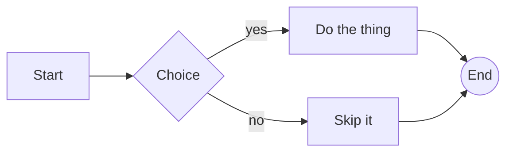
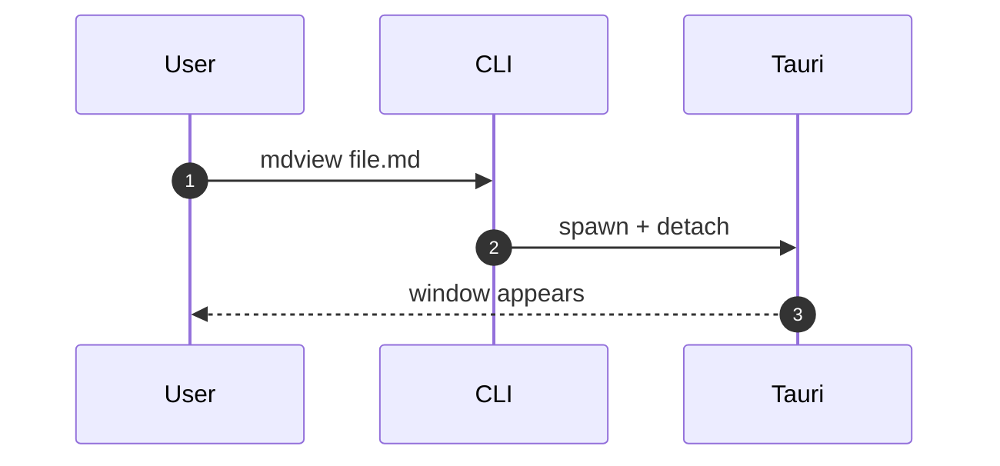
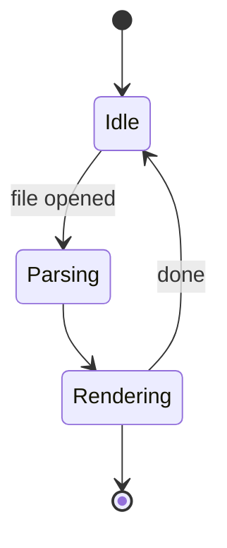
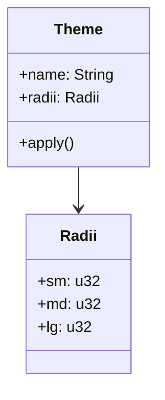
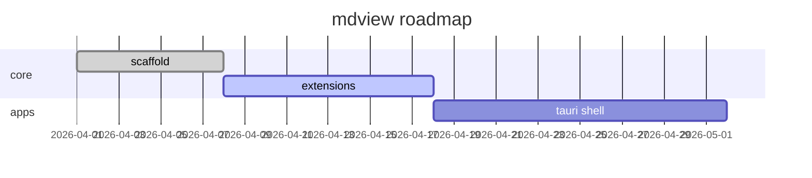

# Mermaid diagrams

## Flowchart

```mermaid
flowchart LR
    A[Start] --> B{Choice}
    B -- yes --> C[Do the thing]
    B -- no  --> D[Skip it]
    C --> E((End))
    D --> E
```

## Sequence

```mermaid
sequenceDiagram
    autonumber
    participant U as User
    participant C as CLI
    participant T as Tauri
    U->>C: mdview file.md
    C->>T: spawn + detach
    T-->>U: window appears
```

## State

```mermaid
stateDiagram-v2
    [*] --> Idle
    Idle --> Parsing : file opened
    Parsing --> Rendering
    Rendering --> Idle : done
    Rendering --> [*]
```

## Class

```mermaid
classDiagram
    class Theme {
      +name: String
      +radii: Radii
      +apply()
    }
    class Radii {
      +sm: u32
      +md: u32
      +lg: u32
    }
    Theme --> Radii
```

## Gantt

```mermaid
gantt
    title mdview roadmap
    dateFormat  YYYY-MM-DD
    section core
    scaffold     :done, a1, 2026-04-01, 7d
    extensions   :active, a2, after a1, 10d
    section apps
    tauri shell  :a3, after a2, 14d
```
