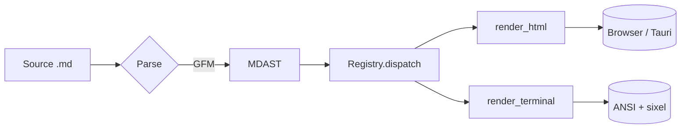
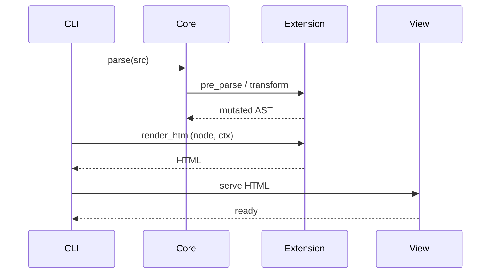
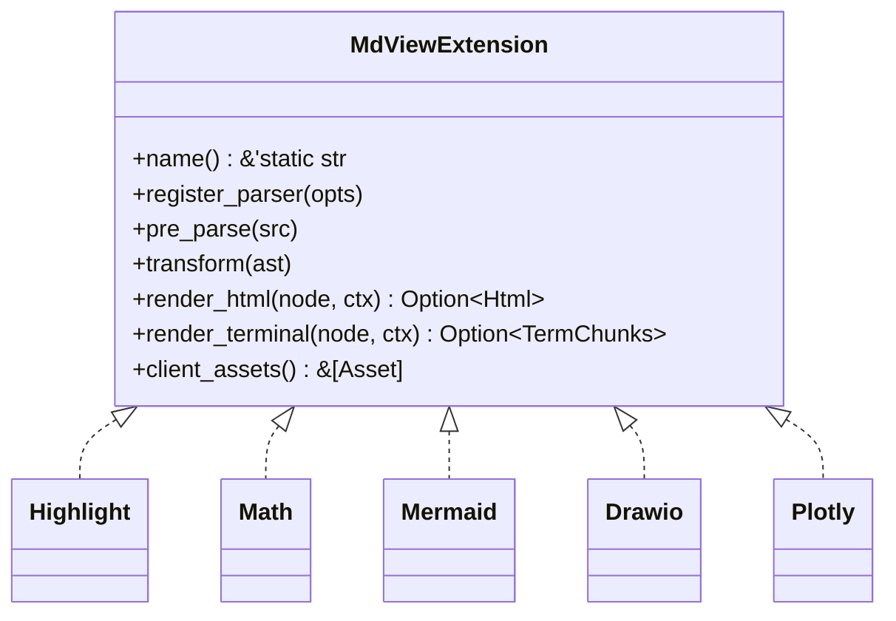
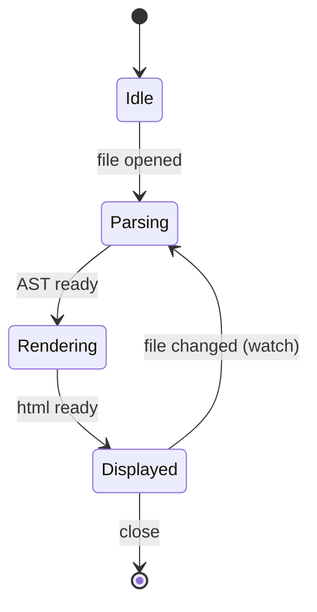

# mdview — syntax & extensions showcase

Everything mdview can render, in a single file. Open with:

```
mdview fixtures/showcase.md
```

> Sections marked **[ext: NAME]** are rendered by a specific mdview extension.
> Everything else is stock GitHub-Flavored Markdown (GFM).

---

## 1. Headings

# H1 — largest
## H2
### H3
#### H4
##### H5
###### H6 — smallest

---

## 2. Inline styles

Plain text with **bold**, *italic*, ***bold italic***, ~~strikethrough~~,
`inline code`, and a [link to example.com](https://example.com).

Autolinks are detected: https://example.org and <user@example.com>.

Keyboard-style inline `Ctrl`+`C`, or a subscript via HTML: H<sub>2</sub>O,
superscript: E = mc<sup>2</sup>.

A hard line break (two trailing spaces) separates this...  
...from this (same paragraph).

---

## 3. Lists

### Unordered, with nesting

- first
  - nested A
    - deeply nested
  - nested B
- second
- third

### Ordered

1. one
2. two
3. three
   1. three-a
   2. three-b

### Task list

- [x] parse markdown
- [x] dispatch to extensions
- [ ] profile hot paths
- [ ] ship v1

---

## 4. Tables

| Extension       | Role                          | Status |
|-----------------|-------------------------------|:------:|
| mdview-core     | parser + trait + registry     |   ✅   |
| mdview-ext-*    | compile-in extensions (5)     |   ✅   |
| mdview-theme    | presets + nvim sync + cache   |  WIP   |
| mdview-pager    | ratatui TUI pager             |  WIP   |

Alignment: `left`, `:center:`, `right:`

| left | center | right |
|:-----|:------:|------:|
| a    |   b    |     c |
| aa   |   bb   |    cc |

---

## 5. Blockquotes

> A simple blockquote with a left accent bar.
>
> It can contain **bold**, `code`, a [link](https://example.com), and span
> multiple paragraphs.

> Nested quotes:
>
> > Inner quote.
> >
> > > Deeper.

---

## 6. Horizontal rule

Everything above the rule…

---

…everything below.

---

## 7. Code blocks — **[ext: highlight (syntect)]**

Server-side syntax highlighting into inline-styled `<span>`s.
The `Highlight` extension runs on every fenced block with a language
tag that syntect knows.

### Rust

```rust
use anyhow::Result;

fn main() -> Result<()> {
    let tree = mdview_core::parse(&arena, "# hi", &registry);
    println!("{}", render(tree));
    Ok(())
}
```

### Python

```python
def fib(n: int) -> int:
    a, b = 0, 1
    for _ in range(n):
        a, b = b, a + b
    return a
```

### JSON

```json
{
  "name": "mdview",
  "extensions": ["drawio", "mermaid", "plotly", "math", "highlight"],
  "theme": "auto"
}
```

### Bash

```bash
cargo build --workspace --release
./target/release/mdview --terminal fixtures/showcase.md
```

### Plain (no language)

```
no language given — rendered as plaintext, no highlighting.
```

---

## 8. Math — **[ext: math (latex2mathml + KaTeX)]**

Inline: $e^{i\pi} + 1 = 0$, and the golden ratio $\varphi = \frac{1 + \sqrt{5}}{2}$.

Display:

$$
\int_{-\infty}^{\infty} e^{-x^2}\, dx = \sqrt{\pi}
$$

$$
\sum_{k=0}^{n} \binom{n}{k} x^k y^{n-k} = (x + y)^n
$$

Matrix via `pmatrix` (wrapped in a fenced `math` block — comrak's
dollar-math parser is line-oriented and splits on the `\\` row separator):

```math
\begin{pmatrix} a & b \\ c & d \end{pmatrix}
\begin{pmatrix} x \\ y \end{pmatrix}
=
\begin{pmatrix} ax + by \\ cx + dy \end{pmatrix}
```

Fenced `math` block (treated as display math):

```math
\mathcal{L} = -\frac{1}{4} F_{\mu\nu} F^{\mu\nu} + i\bar{\psi}\gamma^\mu D_\mu \psi - m\bar{\psi}\psi
```

---

## 9. Mermaid — **[ext: mermaid]**

Flowchart (client-rendered by `mermaid.js`):



Sequence diagram:



Class diagram:



State diagram:



---

## 10. Draw.io — **[ext: drawio]**

Embedded draw.io / diagrams.net XML (client-rendered by the official viewer).

```drawio
<mxfile host="app.diagrams.net">
  <diagram name="Pipeline" id="p1">
    <mxGraphModel dx="800" dy="600" grid="1" gridSize="10" page="1" pageScale="1" pageWidth="850" pageHeight="1100">
      <root>
        <mxCell id="0" />
        <mxCell id="1" parent="0" />
        <mxCell id="2" value="Source" style="rounded=1;whiteSpace=wrap;html=1;fillColor=#dae8fc;strokeColor=#6c8ebf;" vertex="1" parent="1">
          <mxGeometry x="40" y="40" width="120" height="50" as="geometry" />
        </mxCell>
        <mxCell id="3" value="Parser" style="rounded=1;whiteSpace=wrap;html=1;fillColor=#d5e8d4;strokeColor=#82b366;" vertex="1" parent="1">
          <mxGeometry x="220" y="40" width="120" height="50" as="geometry" />
        </mxCell>
        <mxCell id="4" value="Renderer" style="rounded=1;whiteSpace=wrap;html=1;fillColor=#ffe6cc;strokeColor=#d79b00;" vertex="1" parent="1">
          <mxGeometry x="400" y="40" width="120" height="50" as="geometry" />
        </mxCell>
        <mxCell id="5" value="Output" style="rounded=1;whiteSpace=wrap;html=1;fillColor=#f8cecc;strokeColor=#b85450;" vertex="1" parent="1">
          <mxGeometry x="580" y="40" width="120" height="50" as="geometry" />
        </mxCell>
        <mxCell id="10" style="edgeStyle=orthogonalEdgeStyle;rounded=1;html=1;" edge="1" parent="1" source="2" target="3"><mxGeometry relative="1" as="geometry" /></mxCell>
        <mxCell id="11" style="edgeStyle=orthogonalEdgeStyle;rounded=1;html=1;" edge="1" parent="1" source="3" target="4"><mxGeometry relative="1" as="geometry" /></mxCell>
        <mxCell id="12" style="edgeStyle=orthogonalEdgeStyle;rounded=1;html=1;" edge="1" parent="1" source="4" target="5"><mxGeometry relative="1" as="geometry" /></mxCell>
      </root>
    </mxGraphModel>
  </diagram>
</mxfile>
```

---

## 11. Plotly — **[ext: plotly]**

Bar chart:

```plotly
{
  "data": [
    {"type": "bar", "x": ["parse", "transform", "render"], "y": [12, 4, 31], "name": "ms"}
  ],
  "layout": {
    "title": "mdview pipeline cost (ms)",
    "margin": {"t": 40, "r": 10, "b": 40, "l": 40}
  }
}
```

Line chart:

```plotly
{
  "data": [
    {"type": "scatter", "mode": "lines+markers", "x": [0,1,2,3,4,5,6,7,8,9],
     "y": [0,1,3,6,10,15,21,28,36,45], "name": "triangular"}
  ],
  "layout": {
    "title": "Triangular numbers",
    "margin": {"t": 40, "r": 10, "b": 40, "l": 40}
  }
}
```

Scatter with two series:

```plotly
{
  "data": [
    {"type": "scatter", "mode": "markers", "x": [1,2,3,4,5], "y": [2.1,3.4,5.1,7.2,9.0], "name": "A"},
    {"type": "scatter", "mode": "markers", "x": [1,2,3,4,5], "y": [1.2,2.0,3.1,4.0,5.1], "name": "B"}
  ],
  "layout": {
    "title": "Two series",
    "margin": {"t": 40, "r": 10, "b": 40, "l": 40}
  }
}
```

---

## 12. Footnotes

Footnotes[^1] render inline[^deep] with backlinks[^also].

[^1]: First footnote — simple text.
[^deep]: A footnote can contain **bold**, `code`, and a [link](https://example.com).
[^also]: And may span multiple lines if needed.

---

## 13. Wide content — horizontal expansion

mdview does **not** enforce a fixed page width. If any element is wider than
the viewport, the page itself scrolls horizontally; narrow prose stays
comfortably readable in front of it.

### A very long unbroken line

```
this-is-a-deliberately-very-long-single-line-with-no-spaces-whatsoever-so-that-the-renderer-must-either-wrap-it-or-extend-the-page-horizontally-and-we-want-the-page-to-extend-not-wrap-so-that-code-diffs-and-log-lines-and-compiler-errors-and-path-names-like-C:\Users\you\some\really\deeply\nested\workspace\crates\mdview-something\src\submodule\helpers.rs:1234:5-and-backtraces-and-command-lines-render-faithfully-without-line-breaks-introduced-by-soft-wrapping
```

### A wide code block

```rust
// Long function signature typical of async web handlers, with many typed params.
pub async fn handle_extension_dispatch_for_html_with_registry_and_context<'a, 'ctx, R: mdview_core::Registry>(node: &'a comrak::nodes::AstNode<'a>, ctx: &'ctx mdview_core::RenderCtx<'ctx>, registry: &'a R, logger: &mut impl std::io::Write, metrics: &mut mdview_app::metrics::ExtensionMetrics) -> anyhow::Result<Option<mdview_core::Html>> {
    let started = std::time::Instant::now();
    for ext in registry.html_renderers() { if let Some(out) = ext.render_html(node, ctx) { metrics.record(ext.name(), started.elapsed()); return Ok(Some(out)); } }
    Ok(None)
}
```

### A wide table

| col 1 | col 2 | col 3 | col 4 | col 5 | col 6 | col 7 | col 8 | col 9 | col 10 | col 11 | col 12 |
|-------|-------|-------|-------|-------|-------|-------|-------|-------|--------|--------|--------|
| first | second | third | fourth | fifth | sixth | seventh | eighth | ninth | tenth | eleventh | twelfth |
| apples | bananas | cherries | dragonfruit | elderberry | figs | grapes | honeydew | iyokan | jackfruit | kumquat | lemons |
| α | β | γ | δ | ε | ζ | η | θ | ι | κ | λ | μ |

### A wide paragraph with inline code

Paths like `C:\Users\aloknigam\projects\mdview\crates\mdview-ext-highlight\src\lib.rs:42`
and long inline command invocations like `cargo run -p mdview --release -- --terminal --no-pager fixtures/showcase.md | grep -E '(error|warning)' | head -40`
should keep their content legible — the page grows sideways when needed.

---

## 14. Emoji & Unicode

Text can include emoji 🎉 ✨ 🦀 and unicode box drawing: `╭─╮ │ ╰─╯`.

The terminal renderer uses rounded box-drawing for tables and code frames
by design; HTML renderer uses CSS `border-radius`.

---

## 15. What's NOT rendered as an extension

- Raw HTML in markdown (`<details>`, `<summary>`, ``) is passed through
  by comrak but not specially themed by mdview.
- Image tags render as `` — no extension-level image handling (yet).
- YAML front-matter (the `---` block at the top) is stripped by the parser,
  not rendered.

---

## 16. Where to go next

- The **same file** above renders in three places: Tauri/wry window,
  terminal pager (ANSI + sixel), and inside Neovim via the Lua plugin.
- See `CLAUDE.md` for architecture.
- See `apps/mdview/src/builtins.rs` for the extension registration order
  (diagram extensions precede `Highlight` so fenced `mermaid` / `drawio` /
  `plotly` / `math` blocks aren't swallowed by the code-highlighter).

End of showcase.
